.. _graphics:

********
Graphics
********

Introduction
============

This section shows how to make R graphics from rpy2, 
using some of the different graphics systems available to R users.

The purpose of this section is to get users going, and be able to figure out
by reading the R documentation how to perform the same plot in rpy2.

.. module:: rpy2.robjects.lib.grdevices
   :synopsis: High-level interface with R

Graphical devices
-----------------

With `R`, all graphics are plotted into a so-called graphical device.
Graphical devices can be interactive, like for example `X11`, 
or non-interactive, like `png` or `pdf`. Non-interactive devices
appear to be files. It is possible to create custom graphical devices
from Python/rpy2, but this an advanced topic (see :ref:`graphicaldevices-custom`).

By default an interactive R session will open an interactive device
when needing one. If a non-interactive graphical device is needed,
one will have to specify it.

.. note::

   Do not forget to close a non-interactive device when done.
   This can be required to flush pending data from the buffer.

The module :mod:`grdevices` aims at representing the R package
grDevices*. Example with the R functions *png* and *dev.off*:

.. code-block:: python

   from rpy2.robjects.packages import importr
   grdevices = importr('grDevices')

   grdevices.png(file="path/to/file.png", width=512, height=512)
   # plotting code here   
   grdevices.dev_off()

The package contains an :class:`Environment` :data:`grdevices_env` that
can be used to access an object known to belong to that R packages, e.g.:

>>> palette = grdevices.palette()
>>> print(palette)
[1] "black"   "red"     "green3"  "blue"    "cyan"    "magenta" "yellow" 
[8] "gray"

Getting ready
-------------

To run examples in this section we first import
:mod:`rpy2.robjects` and define few helper
functions.

.. literalinclude:: _static/demos/graphics.py
   :start-after: #-- setup-begin
   :end-before: #-- setup-end

Package *lattice*
=================

Introduction
------------

Importing the package `lattice` is done the
same as it is done for other R packages.

.. literalinclude:: _static/demos/graphics.py
   :start-after: #-- setuplattice-begin
   :end-before: #-- setuplattice-end

Scatter plot
------------

We use the dataset *mtcars*, and will use
the lattice function *xyplot* to make scatter plots.

.. literalinclude:: _static/demos/graphics.py
   :start-after: #-- setupxyplot-begin
   :end-before: #-- setupxyplot-end

Lattice is working with formulae (see :ref:`robjects-formula`),
therefore we build one and store values in its environment.
Making a plot is then a matter of calling
the function *xyplot* with the *formula* as
as an argument.

.. literalinclude:: _static/demos/graphics.py
   :start-after: #-- xyplot1-begin
   :end-before: #-- xyplot1-end

The display of group information can be done
simply by using the named parameter groups.
This will indicate the different groups by
color-coding.

.. literalinclude:: _static/demos/graphics.py
   :start-after: #-- xyplot2-begin
   :end-before: #-- xyplot2-end

An alternative to color-coding is to have 
points is different *panels*. In lattice,
this done by specifying it in the formula.

.. literalinclude:: _static/demos/graphics.py
   :start-after: #-- xyplot3-begin
   :end-before: #-- xyplot3-end

Box plot
--------

.. literalinclude:: _static/demos/graphics.py
   :start-after: #-- bwplot1-begin
   :end-before: #-- bwplot1-end

Other plots
-----------

The R package lattice contains a number of other plots, which unfortunately cannot all be detailled here.

.. literalinclude:: _static/demos/graphics.py
   :start-after: #-- wireframe1-begin
   :end-before: #-- wireframe1-end

Splitting the information into different panels can also be specified in the formula. Here we show an artifial
example where the split is made according to the values plotted on the Z axis.

.. literalinclude:: _static/demos/graphics.py
   :start-after: #-- wireframe2-begin
   :end-before: #-- wireframe2-end

Package *ggplot2*
=================

Introduction
------------

The R package *ggplot2* implements the Grammar of Graphics.
While more documentation on the package and its usage with R can be found
on the `ggplot2 website`_, this section will introduce the basic concepts required
to build plots. Obviously, the *R* package *ggplot2* is expected to be installed in the *R*
used from *rpy2*.

.. _ggplot2 website: http://had.co.nz/ggplot2/
 
The package is using the *grid* lower-level plotting infrastructure, that can be accessed
through the module :mod:`rpy2.robjects.lib.grid`. Whenever separate plots on the same device,
or arbitrary graphical elements overlaid, or significant plot customization, or editing,
are needed some knowledge of *grid* will be required.

Here again, having data in a :class:`DataFrame` is expected
(see :ref:`robjects-dataframes` for more information on such objects).

.. literalinclude:: _static/demos/graphics.py
   :start-after: #-- setupggplot2-begin
   :end-before: #-- setupggplot2-end

.. literalinclude:: _static/demos/graphics.py
   :start-after: #-- dataset-begin
   :end-before: #-- dataset-end

Plot
----

.. literalinclude:: _static/demos/graphics.py
   :start-after: #-- ggplot2mtcars-begin
   :end-before: #-- ggplot2mtcars-end

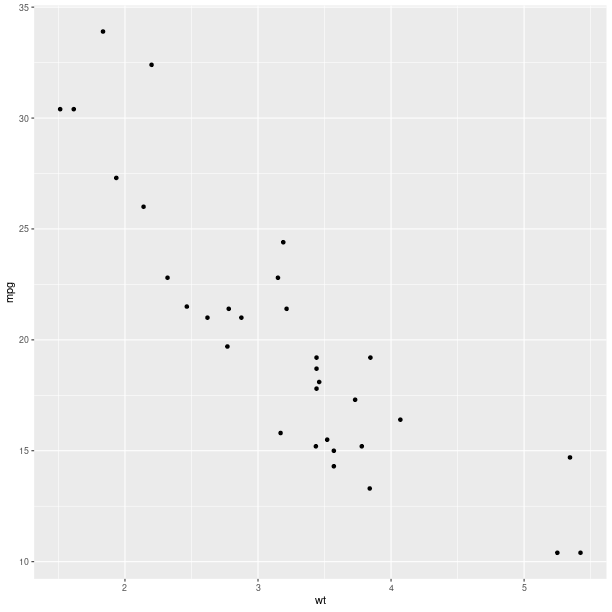

Aesthethics mapping
^^^^^^^^^^^^^^^^^^^

An important concept for the grammar of graphics is the
mapping of variables, or columns in a data frame, to
graphical representations.

Like it was shown for *lattice*, a third variable can be represented
on the same plot using color encoding, and this is now done by
specifying that as a mapping (the parameter *col* when calling
the constructor for the :class:`AesString`).

.. literalinclude:: _static/demos/graphics.py
   :start-after: #-- ggplot2mtcarscolcyl-begin
   :end-before: #-- ggplot2mtcarscolcyl-end
   
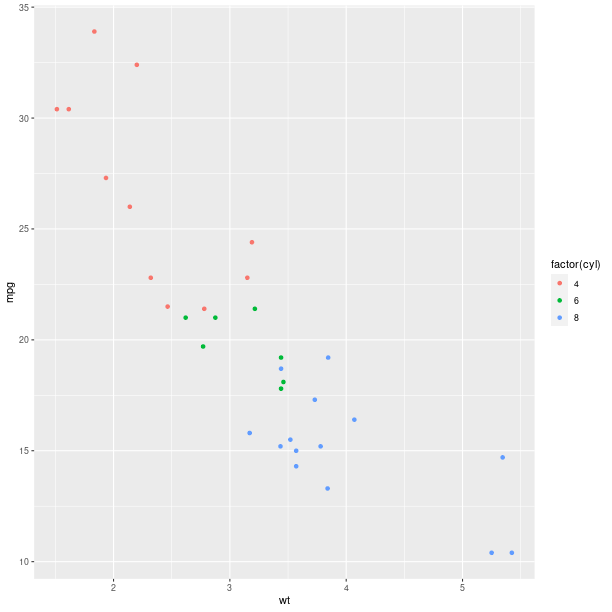

The size of the graphical symbols plotted (here circular dots) can
also be mapped to a variable:

.. literalinclude:: _static/demos/graphics.py
   :start-after: #-- ggplot2aescolsize-begin
   :end-before: #-- ggplot2aescolsize-end
   
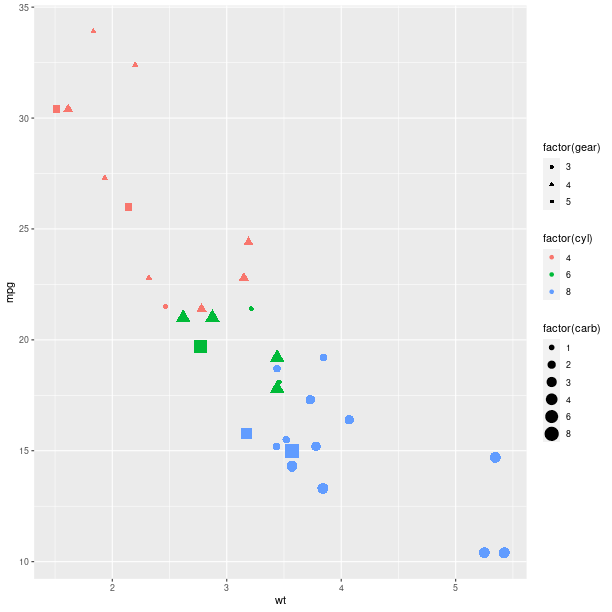

Geometry
^^^^^^^^

The *geometry* is how the data are represented. So far we used a scatter
plot of points, but there are other ways to represent our data.

Looking at the distribution of univariate data can be achieved with
an histogram:

.. literalinclude:: _static/demos/graphics.py
   :start-after: #-- ggplot2geomhistogram-begin
   :end-before: #-- ggplot2geomhistogram-end
   
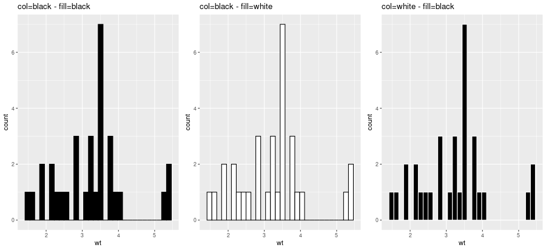

.. literalinclude:: _static/demos/graphics.py
   :start-after: #-- ggplot2geomhistogramfillcyl-begin
   :end-before: #-- ggplot2geomhistogramfillcyl-end
   
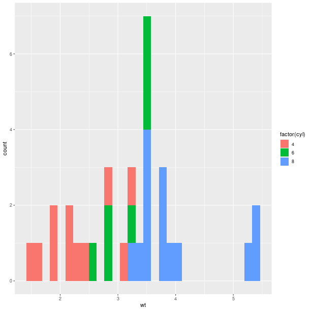

Barplot-based representations of several densities on the same
figure can often be lacking clarity and line-based representation,
either :func:`geom_freqpoly` (representation of the frequency as broken
lines) or :func:`geom_density` (plot a density estimate),
can be in better.

.. literalinclude:: _static/demos/graphics.py
   :start-after: #-- ggplot2geomfreqpolyfillcyl-begin
   :end-before: #-- ggplot2geomfreqpolyfillcyl-end
   
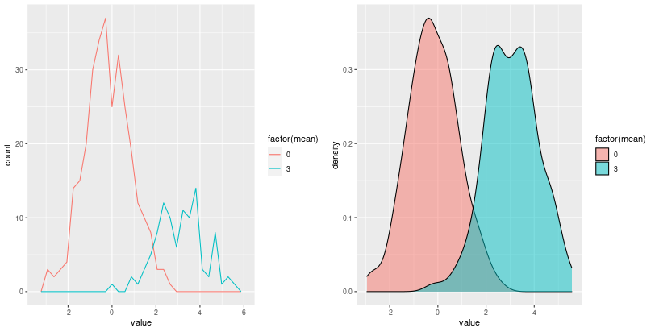

Whenever a large number of points are present, it can become interesting
to represent the density of "dots" on the scatterplot.

With 2D bins:

.. literalinclude:: _static/demos/graphics.py
   :start-after: #-- ggplot2geombin2d-begin
   :end-before: #-- ggplot2geombin2d-end

With a kernel density estimate:

.. literalinclude:: _static/demos/graphics.py
   :start-after: #-- ggplot2geomdensity2d-begin
   :end-before: #-- ggplot2geomdensity2d-end

With hexagonal bins:

.. literalinclude:: _static/demos/graphics.py
   :start-after: #-- ggplot2geomhexbin-begin
   :end-before: #-- ggplot2geomhexbin-end

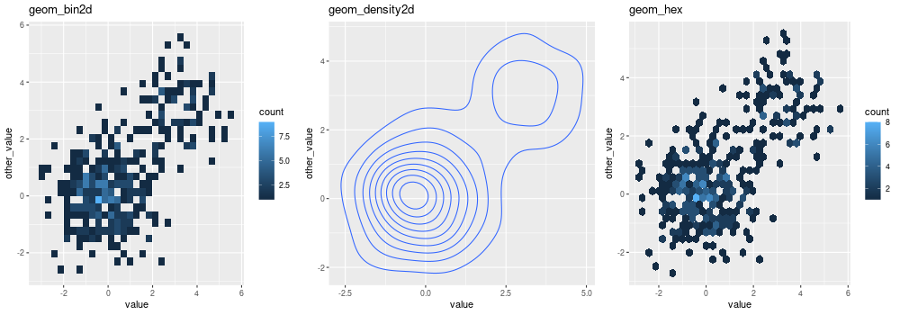

Box plot:

.. literalinclude:: _static/demos/graphics.py
   :start-after: #-- ggplot2geomboxplot-begin
   :end-before: #-- ggplot2geomboxplot-end
   

Boxplots can be used to represent a *summary* of the data with an emphasis
on location and spread.

.. literalinclude:: _static/demos/graphics.py
   :start-after: #-- ggplot2aescolboxplot-begin
   :end-before: #-- ggplot2aescolboxplot-end
   
.. image:: _static/graphics_ggplot2aescolboxplot.png
   :scale: 50

Models fitted to the data are also easy to add to a plot:

.. literalinclude:: _static/demos/graphics.py
   :start-after: #-- ggplot2addsmooth-begin
   :end-before: #-- ggplot2addsmooth-end

   
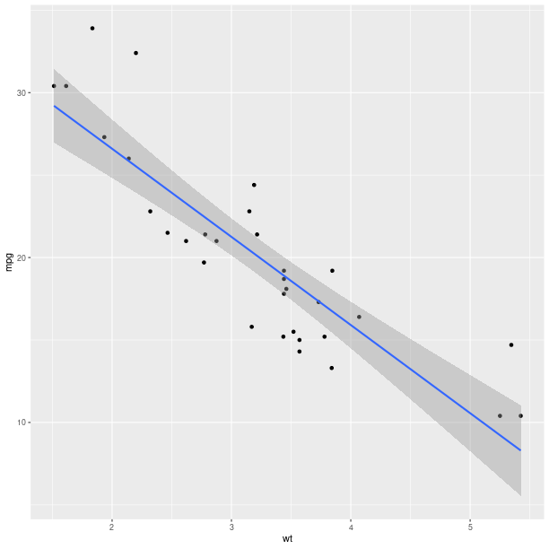

The *method* can be one of {*glm*, *gam*, *loess*, *rlm*},
and formula can be specified to declared the fitting (see example below).

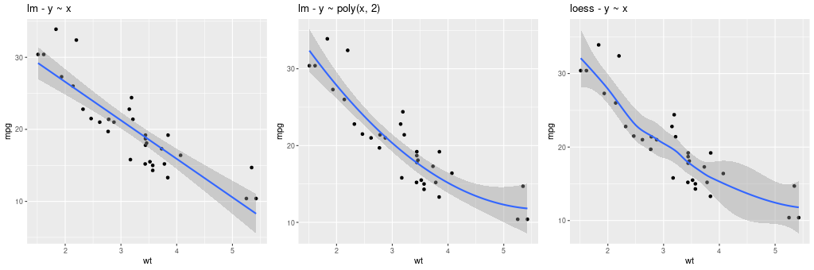

The constructor for :class:`GeomSmooth` also accepts a parameter
*groupr* that indicates if the fit should be done according to groups.

.. literalinclude:: _static/demos/graphics.py
   :start-after: #-- ggplot2smoothbycyl-begin
   :end-before: #-- ggplot2smoothbycyl-end
   
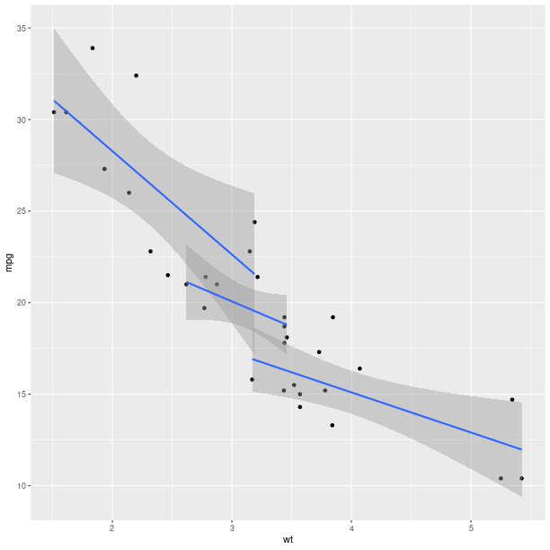

Encoding the information in the column *cyl* is again
only a matter of specifying it in the :class:`AesString` mapping.

.. literalinclude:: _static/demos/graphics.py
   :start-after: #-- ggplot2smoothbycylwithcolours-begin
   :end-before: #-- ggplot2smoothbycylwithcolours-end

   
.. image:: _static/graphics_ggplot2_smoothbycylwithcolours.png
   :scale: 50

As can already be observed in the examples with :class:`GeomSmooth`,
several *geometry* objects can be added on the top of each other
in order to create the final plot. For example, a marginal *rug*
can be added to the axis of a regular scatterplot:

.. literalinclude:: _static/demos/graphics.py
   :start-after: #-- ggplot2geompointandrug-begin
   :end-before: #-- ggplot2geompointandrug-end
   

.. literalinclude:: _static/demos/graphics.py
   :start-after: #-- ggplot2geompointdensity2d-begin
   :end-before: #-- ggplot2geompointdensity2d-end
   
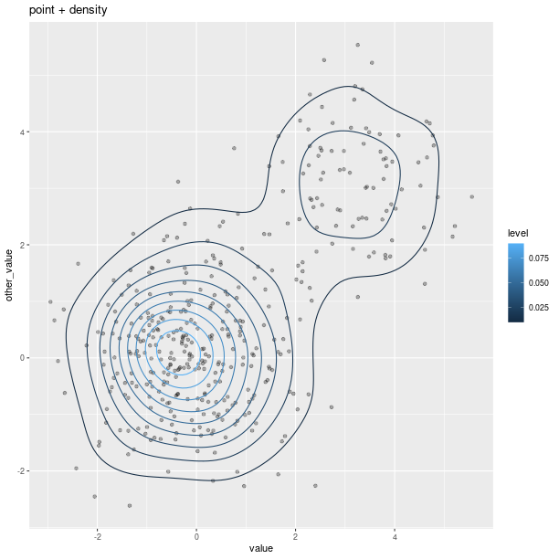

Polygons can be used for maps, as shown in the relatively artificial
example below:

.. literalinclude:: _static/demos/graphics.py
   :start-after: #-- ggplot2mappolygon-begin
   :end-before: #-- ggplot2mappolygon-end
   
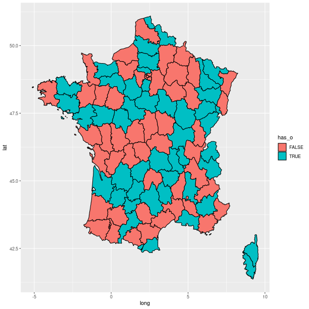

Axes
^^^^

Axes can be transformed and configured in various ways.

A common transformation is the log-transform of the coordinates.

.. literalinclude:: _static/demos/graphics.py
   :start-after: #-- ggplot2mtcarscoordtrans-begin
   :end-before: #-- ggplot2mtcarscoordtrans-end

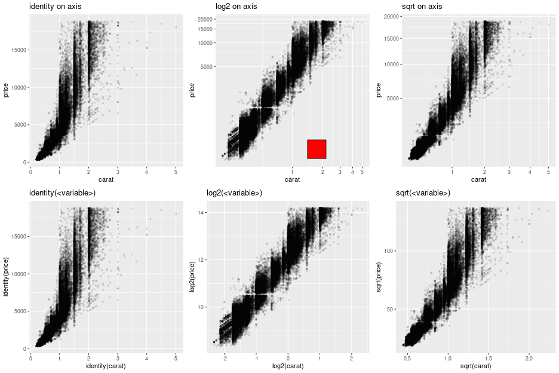

.. note:: 

   The red square is an example of adding graphical 
   elements to a ggplot2 figure.

   .. literalinclude:: _static/demos/graphics.py
      :start-after: #-- ggplot2mtcarscoordtransannot-begin
      :end-before: #-- ggplot2mtcarscoordtransannot-end

Facets
^^^^^^

Splitting the data into panels, in a similar fashion to what we did
with *lattice*, is now a matter of adding *facets*. 
A central concept to *ggplot2* is that plot are made of added
graphical elements, and adding specifications such as "I want my data
to be split in panel" is then a matter of adding that information
to an existing plot.

For example, splitting the plots on the data in column *cyl* 
is still simply done by adding a :class:`FacetGrid`.

.. literalinclude:: _static/demos/graphics.py
   :start-after: #-- ggplot2smoothbycylfacetcyl-begin
   :end-before: #-- ggplot2smoothbycylfacetcyl-end

   

The way data are represented (the *geometry* in the terminology
used the grammar of graphics) are still specified the usual way.

.. literalinclude:: _static/demos/graphics.py
   :start-after: #-- ggplot2histogramfacetcyl-begin
   :end-before: #-- ggplot2histogramfacetcyl-end

   
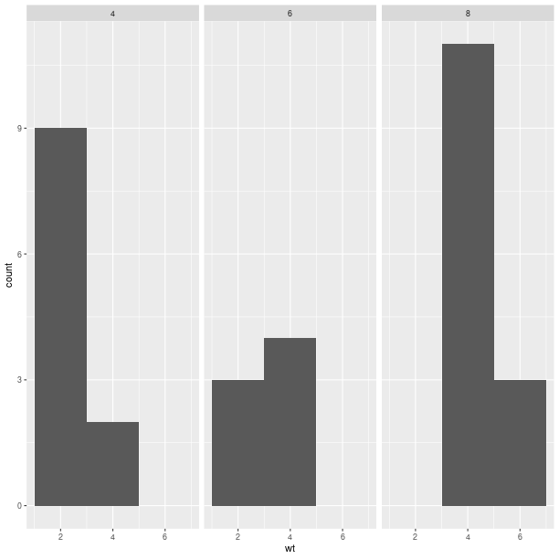

.. literalinclude:: _static/demos/graphics.py
   :start-after: #-- qplot4-begin
   :end-before: #-- qplot4-end
   
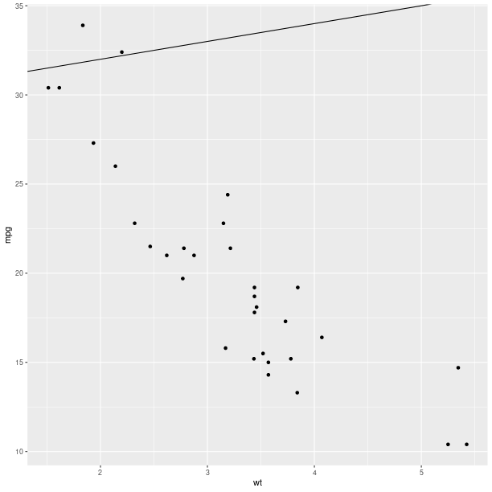

.. literalinclude:: _static/demos/graphics.py
   :start-after: #-- qplot3addline-begin
   :end-before: #-- qplot3addline-end

   

.. literalinclude:: _static/demos/graphics.py
   :start-after: #-- ggplot2smoothblue-begin
   :end-before: #-- ggplot2smoothblue-end

   
.. image:: _static/graphics_ggplot2smoothblue.png
   :scale: 50

.. literalinclude:: _static/demos/graphics.py
   :start-after: #-- ggplot2smoothblue-begin
   :end-before: #-- ggplot2smoothblue-end

   
.. image:: _static/graphics_ggplot2smoothblue.png
   :scale: 50

Extensions and new features
---------------------------

The R package `ggplot2` is under active development, and new
methods (geometry, summary statistics, theme customizations)
are added regularly. In addition to this there exists a
dynamic ecosystem of R packages proposing extensions, and
a user may need R code for ggplot2 not included in our
module. The following steps should make writing the Python
wrapper code a very minimal effort in many cases:

1. Identify the matching type of extension in our class diagram for
   :mod:`rpy2.robjects.lib.ggplot2` (for example, is this an new
   "geometry", statistics, coordinates, theme ?). For example the ggplot2
   function `stat_quantile` is a statistics and the best matching class is
   :class:`rpy2.robjects.lib.ggplot2.Stat`. The more general ancestor
   class :class:`rpy2.robjects.lib.ggplot2.GBaseObject` could also be used.

2. Implement a child class that assign to the class attribute
   :attr:`_constructor` the R constructor function. For example
   `stat_quantile`. The Python callable mapping the R constructor
   is then the class method :meth:`new`. The complete implementation
   for `stat_quantile` is then:
   
   .. code-block:: python

      from rpy2.robjects.packages import importr
      ggplot2_rpack = importr('ggplot2')
      class StatQuantile(Stat):
          """ Continuous quantiles """
          _constructor = ggplot2_rpack.stat_quantile

      stat_quantile = StatQuantile.new

   The callable :func:`stat_quantile` can now be used like any
   other ggplot2 statistics in :mod:`rpy2.robjects.lib.ggplot2`
   (and the object it returns can be added to compose a final
   ggplot figure).

Class diagram
-------------

.. inheritance-diagram:: rpy2.robjects.lib.ggplot2.GBaseObject
			 rpy2.robjects.lib.ggplot2.Coord
			 rpy2.robjects.lib.ggplot2.Element
			 rpy2.robjects.lib.ggplot2.Facet
			 rpy2.robjects.lib.ggplot2.Geom
			 rpy2.robjects.lib.ggplot2.GGPlot
			 rpy2.robjects.lib.ggplot2.Scale
			 rpy2.robjects.lib.ggplot2.Stat
			 rpy2.robjects.lib.ggplot2.Theme
   :parts: 1

Package *grid*
==============

The *grid* package is the underlying plotting environment for *lattice*
and *ggplot2* figures. In few words, it consists in pushing and poping systems
of coordinates (*viewports*) into a stack, and plotting graphical elements into them.
The system can be thought of as a scene graph, with each *viewport* a node in
the graph.

>>> from rpy2.robjects.lib import grid

Getting a new page is achieved by calling the function :func:`grid.newpage`.

Calling :func:`layout` will create a layout, e.g. create a layout with one row
and 3 columns:

>>> lt = grid.layout(1, 3)

That layout can be used to construct a viewport:

>>> vp = grid.viewport(layout = lt)

The created viewport corresponds to a graphical entity.
Pushing into the current viewport, can be done by using the class method
:meth:`grid.Viewport.push`:

>>> vp.push()

Example:

.. literalinclude:: _static/demos/graphics.py
   :start-after: #-- grid-begin
   :end-before: #-- grid-end
   

Custom ggplot2 layout with grid
-------------------------------

.. literalinclude:: _static/demos/graphics.py
   :start-after: #-- gridwithggplot2-begin
   :end-before: #-- gridwithggplot2-end
   
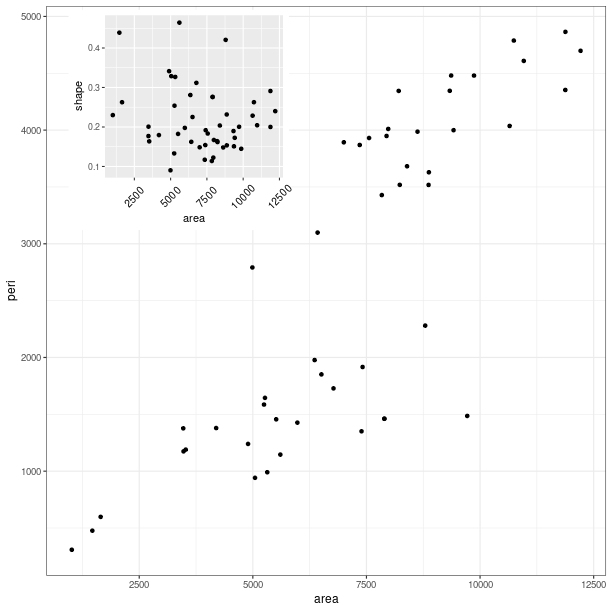

Classes
-------

.. autoclass:: rpy2.robjects.lib.grid.Viewport(o)
   :show-inheritance:
   :members:
   :undoc-members:

.. autoclass:: rpy2.robjects.lib.grid.Grob(o)
   :show-inheritance:
   :members:
   :undoc-members:

.. autoclass:: rpy2.robjects.lib.grid.GTree(o)
   :show-inheritance:
   :members:
   :undoc-members:

Class diagram
-------------

.. inheritance-diagram:: rpy2.robjects.lib.grid
   :parts: 1

