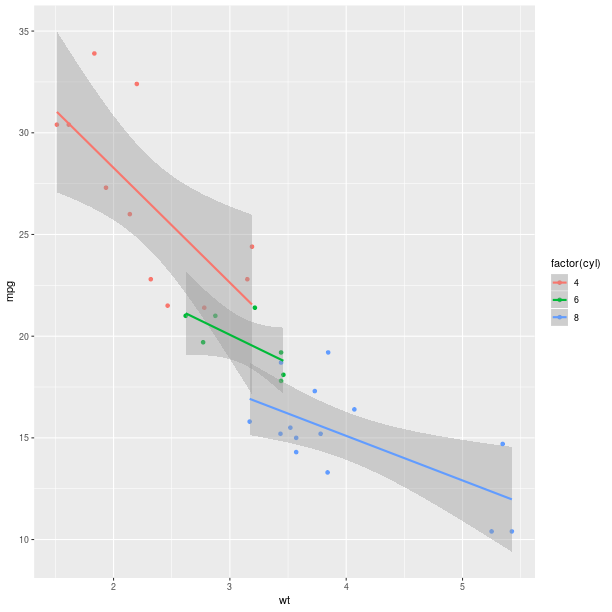

********************
Introduction to rpy2
********************

This introduction is intended for new users, or users who never consulted
the documentation but encountered blockers after guessing successfully
their first steps through the API.

Getting started
===============

It is assumed here that the rpy2 package has been properly installed.
This will be the case if working out of one of the Docker containers available,
of if the instructions were followed (see :ref:`install-installation`).

`rpy2` is like any other python package binding to a C library. Its top
level can be imported, and the version obtained. 

.. code-block:: python

   import rpy2
   print(rpy2.__version__)

.. note::

   The rpy2 version is rather important when reporting an issue with rpy2,
   or in your own code if trying to assess whether rpy2 is matching the
   expected version.

   A utility module is included to report what rpy2's environment.
   
   .. code-block:: bash

      python -m rpy2.situation

   If unable to run python from the command line, or unsure about about to do
   it, the same information can be obtained from a Python terminal (or notebook).
   
   .. code-block:: python

      import rpy2.situation
      for row in rpy2.situation.iter_info():
          print(row)

:mod:`rpy2` is providing  2 levels of interface with R:
- low-level (:mod:`rpy2.rinterface`, and :mod:`rpy2:rinterface_lib`)
- high-level (:mod:`rpy2.robjects`)

The high-level interface is trying to make the use of R as natural as
possible for a Python user (something sometimes referred to as
"pythonic"), and this introduction only covers that interface.

Importing the top-level sub-package is also initializing and starting
R embedded in the current Python process:

.. code-block:: python

   import rpy2.robjects as robjects

   
R packages
==========

R is arguably one of the best data analysis toolboxes because of the
breadth and depth of its packages.

Importing packages
------------------

Importing R packages is often the first step when running R code, and
`rpy2` is providing a function :func:`rpy2.robjects.packages.importr`
that makes that step very similar to importing Python packages.

.. code-block:: python

   from rpy2.robjects.packages import importr
   # import R's "base" package
   base = importr('base')

   # import R's "utils" package
   utils = importr('utils')

In essence, that step is importing the R package in the embedded R,
and is exposing all R objects in that package as Python objects.

.. note::

   There is a twist though. R object names can contain a `"."` (dot)
   while in Python the dot means "attribute in a namespace". Because
   of this, `importr` is trying to translate `"."` into `"_"`. The details
   will not be necessary in most of the cases, but when they do the
   documentation for :ref:`robjects-packages` should be consulted.

   
Installing packages
-------------------

Knowing how to install R packages is an important skill to have,
although not always a mandatory one if working out of an R installation
designed to meet all reasonable needs for a task or a project.

.. note::

   Package installation is presented early in the introduction,
   but this subsection
   can be skipped if difficulties such as an absence of internet connection,
   an uncooperative proxy (or proxy maintainer),
   or insufficient write priviledges to install
   the package are met.

Downloading and installing R packages is usually performed by fetching
R packages from a package repository and installing them locally.
Capabilities to do this are provided by R libraries, and when in Python
we can simply use them using rpy2. An interface to the R features is
provided in :mod:`rpy2.robjects.packages` (where the function :func:`importr`
introduced above is defined).

Getting ready to install packages from the first mirror known to R is done
with:

.. code-block:: python

   # import rpy2's package module
   import rpy2.robjects.packages as rpackages
   
   # import R's utility package
   utils = rpackages.importr('utils')
   
   # select a mirror for R packages
   utils.chooseCRANmirror(ind=1) # select the first mirror in the list

We are now ready to install packages using R's own function `install.package`:

.. code-block:: python

   # R package names
   packnames = ('ggplot2', 'hexbin')

   # R vector of strings
   from rpy2.robjects.vectors import StrVector
   
   # Selectively install what needs to be install.
   # We are fancy, just because we can.
   names_to_install = [x for x in packnames if not rpackages.isinstalled(x)]
   if len(names_to_install) > 0:
       utils.install_packages(StrVector(names_to_install))

The code above can be part of Python code you distribute if you are relying
on CRAN packages not distributed with R by default.

More documentation about the handling of R packages in `rpy2` can be found
Section :ref:`robjects-packages`.

The `r` instance
================

We mentioned earlier that `rpy2` is running an embedded R. This is may be
a little abstract, so there is an object :data:`rpy2.robjects.r` to make
it tangible.

This object can be used as rudimentary communication channel between
Python and R,
similar to the way one would interact with a subprocess yet more efficient,
better integrated with Python, and easier to use.

Getting R objects
-----------------

      
The :meth:`__getitem__` method of :data:`rpy2.robjects.r`,
gets the R object associated with a given symbol, just
as typing that symbol name in the R console would do it
(see the note below for details).

Example in R:

.. code-block:: r

   > pi
   [1] 3.141593

With :mod:`rpy2`:

>>> pi = robjects.r['pi']
>>> pi[0]
3.14159265358979

.. note::

   Under the hood, the variable `pi` is gotten by default from the
   R *base* package, unless an other variable with the name `pi` was
   created in R's `.globalEnv`. 
   
   Whenever one wishes to be specific about where the symbol
   should be looked for (which should be most of the time),
   it possible to wrap R packages in Python namespace objects
   (see :ref:`robjects-packages`).
   
   For more details on environments, see Section 
   :ref:`robjects-environments`.

   Also, note that *pi* is not a scalar but a vector of length 1

Evaluating R code
-----------------

The object :data:`r` is also callable, and the string passed in
a call is evaluated as `R` code.

The simplest such strings would be the name of an R object,
and this provide an alternative to
the method `__getitem__` described earlier.

Example in R:

.. code-block:: r

   > pi
   [1] 3.141593

With :mod:`rpy2`:

>>> pi = robjects.r('pi')
>>> pi[0]
3.14159265358979

.. warning::

   The result is an R vector. The Section
   :ref:`introduction-vectors` below will provide explanation
   for the following behavior:
   
   >>> piplus2 = robjects.r('pi') + 2
   >>> piplus2.r_repr()
   c(3.14159265358979, 2)
   >>> pi0plus2 = robjects.r('pi')[0] + 2
   >>> print(pi0plus2)
   5.1415926535897931

More complex strings are R expressions of arbitrary complexity,
or even sequences of expressions (snippets of R code).
Their evaluation is performed in what is known to R users as the 
`Global Environment`, that is the place one starts at when in
the R console. Whenever the `R` code creates variables, those
variables are "located" in that `Global Environment` by default.

For example, the string below returns the value 18.85. 

.. code-block:: r

   robjects.r('''
           # create a function `f`
	   f <- function(r, verbose=FALSE) {
               if (verbose) {
                   cat("I am calling f().\n")
               }
               2 * pi * r 
           }
	   # call the function `f` with argument value 3
           f(3)
	   ''')

That string is a snippet of R code (complete with comments) that
first creates an R function, then binds it to the symbol `f` (in R),
finally calls that function `f`. The results of the call (what the
R function `f` is returns) is returned to Python.

Since that function `f` is now present in the R `Global Environment`,
it can be accessed with the `__getitem__` mechanism outlined above:

>>> r_f = robjects.globalenv['f']
>>> print(r_f.r_repr())
function (r, verbose = FALSE) 
{
    if (verbose) {
        cat("I am calling f().\n")
    }
    2 * pi * r
}

.. note:: 

   As shown earlier, an alternative way to get the function
   is to get it from the :class:`R` singleton

   >>> r_f = robjects.r['f']

The function r_f is callable, and can be used like a regular Python function.

>>> res = r_f(3)

Jump to Section :ref:`robjects-introduction-functions` for more on calling
functions.

Interpolating R objects into R code strings
-------------------------------------------

Against the first impression one may get from the title
of this section, simple and handy features of :mod:`rpy2` are
presented here.

An R object has a string representation that can be used
directly into R code to be evaluated.

Simple example:

>>> letters = robjects.r['letters']
>>> rcode = 'paste(%s, collapse="-")' %(letters.r_repr())
>>> res = robjects.r(rcode)
>>> print(res)
"a-b-c-d-e-f-g-h-i-j-k-l-m-n-o-p-q-r-s-t-u-v-w-x-y-z"

.. _introduction-vectors:

R vectors
=========

In `R`, data are mostly represented by vectors, even when looking
like scalars.

When looking closely at the R object `pi` used previously,
we can observe that this is in fact a vector of length 1.

>>> len(robjects.r['pi'])
1

As such, the python method :meth:`add` will result in a concatenation
(function `c()` in R), as this is the case for regular python lists.

Accessing the one value in that vector has to be stated
explicitly:

>>> robjects.r['pi'][0]
3.1415926535897931

There is much that can be achieved with vectors, having them to behave
more like Python lists or R vectors.
A comprehensive description of the behavior of vectors is found in
:mod:`robjects.vector`.

Creating rpy2 vectors
---------------------

Creating R vectors can be achieved simply:

>>> res = robjects.StrVector(['abc', 'def'])
>>> print(res.r_repr())
c("abc", "def")
>>> res = robjects.IntVector([1, 2, 3])
>>> print(res.r_repr())
1:3
>>> res = robjects.FloatVector([1.1, 2.2, 3.3])
>>> print(res.r_repr())
c(1.1, 2.2, 3.3)

R matrixes and arrays are just vectors with a `dim` attribute.

The easiest way to create such objects is to do it through
R functions:

>>> v = robjects.FloatVector([1.1, 2.2, 3.3, 4.4, 5.5, 6.6])
>>> m = robjects.r['matrix'](v, nrow = 2)
>>> print(m)
     [,1] [,2] [,3]
[1,]  1.1  3.3  5.5
[2,]  2.2  4.4  6.6

.. _robjects-introduction-functions:

Calling R functions
===================

Calling R functions is disappointingly similar to calling
Python functions:

>>> rsum = robjects.r['sum']
>>> rsum(robjects.IntVector([1,2,3]))[0]
6L

Keywords are also working:

>>> rsort = robjects.r['sort']
>>> res = rsort(robjects.IntVector([1,2,3]), decreasing=True)
>>> print(res.r_repr())
c(3L, 2L, 1L)

.. note::

   By default, calling R functions returns R objects.

More information on functions is in Section :ref:`robjects-functions`.

Getting help
============

R has a builtin help system that, just like the pydoc strings are used frequently
in python during interactive sessions, is used very frequently by R programmmers.
This help system is accessible from an R function, therefore accessible from rpy2.

Help on a topic within a given package, or currently loaded packages
---------------------------------------------------------------------

>>> from rpy2.robjects.packages import importr
>>> utils = importr("utils") 
>>> help_doc = utils.help("help")
>>> help_doc[0]
'/where/R/is/installed/library/utils/help/help'

Converting the object returned to a string produces the full help text
on the topic:

>>> str(help_doc)
[...long output...]

.. warning::
   
   The help message so produced is not a string returned to the console
   but is directly printed by R to the standard output. The call to
   :func:`str` only returns an empty string, and the reason for this is
   somewhat involved for an introductory documentation.
   This behaviour is rooted in :program:`R` itself and in :mod:`rpy2` the
   string representation of R objects is the string representation as
   given by the :program:`R` console,
   which in that case takes a singular route.

   For a Python friendly help to the R help system, consider the module
   :mod:`rpy2.robjects.help`.

Locate topics among available packages
--------------------------------------

>>> help_where = utils.help_search("help")

As before with `help`, the result can be printed / converted to a string,
giving a similar result to what is obtained from an R session.

.. note::

   The data structure returned can otherwise be used to access the information
   returned in details.

   >>> tuple(help_where)
   (<StrVector - Python:0x1f9a968 / R:0x247f908>,
    <StrVector - Python:0x1f9a990 / R:0x25079d0>,
    <StrVector - Python:0x1f9a9b8 / R:0x247f928>,
    <Matrix - Python:0x1f9a850 / R:0x1ec0390>)
   >>> tuple(help_where[3].colnames)
   ('topic', 'title', 'Package', 'LibPath')

   However, this is beyond the scope of an introduction, and one should
   master the content of the module :mod:`robjects.vector` before anything else.

Examples
========

This section demonstrates some of the features of
rpy2.

Graphics and plots
------------------

.. code-block:: python

  import rpy2.robjects as robjects

  r = robjects.r

  x = robjects.IntVector(range(10))
  y = r.rnorm(10)

  r.X11()

  r.layout(r.matrix(robjects.IntVector([1,2,3,2]), nrow=2, ncol=2))
  r.plot(r.runif(10), y, xlab="runif", ylab="foo/bar", col="red")

Setting dynamically the number of arguments in a function call can be
done the usual way in python.

There are several ways to plot data in `R`, some of which are
presented in this documentation:

The general setup is repeated here:

.. literalinclude:: _static/demos/graphics.py
   :start-after: #-- setup-begin
   :end-before: #-- setup-end

The setup specific to ggplot2 is:

.. literalinclude:: _static/demos/graphics.py
   :start-after: #-- setupggplot2-begin
   :end-before: #-- setupggplot2-end

.. literalinclude:: _static/demos/graphics.py
   :start-after: #-- ggplot2smoothbycylwithcolours-begin
   :end-before: #-- ggplot2smoothbycylwithcolours-end

   

More about plots and graphics in R, as well as more advanced
plots are presented in Section :ref:`graphics`.

.. warning::

   By default, the embedded R open an interactive plotting device,
   that is a window in which the plot is located.
   Processing interactive events on that devices, such as resizing or closing
   the window must be explicitly required
   (see Section :ref:`rinterface-interactive-processevents`).

Linear models
-------------

The R code is:

.. code-block:: r

   ctl <- c(4.17,5.58,5.18,6.11,4.50,4.61,5.17,4.53,5.33,5.14)
   trt <- c(4.81,4.17,4.41,3.59,5.87,3.83,6.03,4.89,4.32,4.69)
   group <- gl(2, 10, 20, labels = c("Ctl","Trt"))
   weight <- c(ctl, trt)

   anova(lm.D9 <- lm(weight ~ group))

   summary(lm.D90 <- lm(weight ~ group - 1))# omitting intercept

One way to achieve the same with :mod:`rpy2.robjects` is

.. code-block:: python

   from rpy2.robjects import FloatVector
   from rpy2.robjects.packages import importr
   stats = importr('stats')
   base = importr('base')

   ctl = FloatVector([4.17,5.58,5.18,6.11,4.50,4.61,5.17,4.53,5.33,5.14])
   trt = FloatVector([4.81,4.17,4.41,3.59,5.87,3.83,6.03,4.89,4.32,4.69])
   group = base.gl(2, 10, 20, labels = ['Ctl','Trt'])
   weight = ctl + trt

   robjects.globalenv['weight'] = weight
   robjects.globalenv['group'] = group
   lm_D9 = stats.lm('weight ~ group')
   print(stats.anova(lm_D9))

   # omitting the intercept
   lm_D90 = stats.lm('weight ~ group - 1')
   print(base.summary(lm_D90))

This way to perform a linear fit it matching precisely the way in R presented
above, but there are other ways (see Section :ref:`robjects-formula`
for storing the variables directly in the lookup environment of the formula).

Q: Now how to extract data from the resulting objects ?

A: Well, it all depends on the object. R is very much designed
for interactive sessions, and users often inspect what a
function is returning in order to know how to extract information.

When taking the results from the code above, one could go like:

>>> print(lm_D9.rclass)
[1] "lm" 

Here the resulting object is a list structure, as either inspecting
the data structure or reading the R man pages for `lm` would tell us.
Checking its element names is then trivial:

>>> print(lm_D9.names)
 [1] "coefficients"  "residuals"     "effects"       "rank"         
 [5] "fitted.values" "assign"        "qr"            "df.residual"  
 [9] "contrasts"     "xlevels"       "call"          "terms"        
[13] "model" 

And so is extracting a particular element:

>>> print(lm_D9.rx2('coefficients'))
(Intercept)    groupTrt 
      5.032      -0.371 

or 

>>> print(lm_D9.rx('coefficients'))
$coefficients
(Intercept)    groupTrt 
      5.032      -0.371 

More about extracting elements from vectors is available
at :ref:`robjects-extracting`.

   
Principal component analysis
----------------------------

The R code is

.. code-block:: r

  m <- matrix(rnorm(100), ncol=5)
  pca <- princomp(m)
  plot(pca, main="Eigen values")
  biplot(pca, main="biplot")

The :mod:`rpy2.robjects` code can be as close to the
R code as possible:

.. testcode::

  import rpy2.robjects as robjects

  r = robjects.r

  m = r.matrix(r.rnorm(100), ncol=5)
  pca = r.princomp(m)
  r.plot(pca, main="Eigen values")
  r.biplot(pca, main="biplot")

However, the same example can be made a little tidier
(with respect to being specific about R functions used)

.. testcode::

   from rpy2.robjects.packages import importr

   base     = importr('base')
   stats    = importr('stats')
   graphics = importr('graphics')

   m = base.matrix(stats.rnorm(100), ncol = 5)
   pca = stats.princomp(m)
   graphics.plot(pca, main = "Eigen values")
   stats.biplot(pca, main = "biplot") 

Creating an R vector or matrix, and filling its cells using Python code
-----------------------------------------------------------------------

.. testcode::

   from rpy2.robjects import NA_Real
   from rpy2.rlike.container import TaggedList
   from rpy2.robjects.packages import importr

   base = importr('base')

   # create a numerical matrix of size 100x10 filled with NAs 
   m = base.matrix(NA_Real, nrow=100, ncol=10)

   # fill the matrix
   for row_i in xrange(1, 100+1):
       for col_i in xrange(1, 10+1):
           m.rx[TaggedList((row_i, ), (col_i, ))] = row_i + col_i * 100

.. testoutput::

   None

One more example
----------------

.. literalinclude:: _static/demos/example01.py

