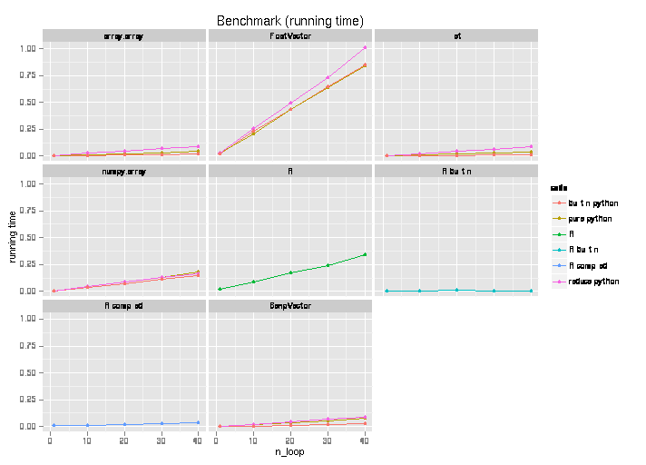

.. _misc-performances:

************
Performances
************

Optimizing for performances
===========================

Memory usage
------------

R objects live in the R memory space, their size unbeknown to Python,
and because of that it seems that Python does not always garbage collect often enough when
large objects are involved. This is sometimes leading to transient increased memory usage when large
objects are overwritten in loops, and although reaching a system's memory limit appears
to trigger garbage collection, one may wish to explicitly trigger the collection.

.. code-block:: python

   import gc
   gc.collect()

As a concrete example, consider the code below. This has been used somewhere a unique benchmark
Python-to-R bridge, unfortunately without considering specificities of the Python and R respective garbage
collection mechanisms. The outcome of the benchmark changes dramatically, probably putting back rpy2 as
the fastest, most memory efficient, and most versatile Python-to-R bridge.

.. code-block:: python

   import rpy2.robjects
   import gc

   r = rpy2.robjects.r

   r("a <- NULL")
   for i in range(20):
       rcode = "a <- rbind(a, seq(1000000) * 1.0 * %d)" % i
       r(rcode)
       print r("sum(a)")
       # explicit garbage collection
       gc.collect()

Low-level interface
-------------------

The high-level layer :mod:`rpy2.robjects` brings a lot of convenience, such a class
mappings and interfaces, but obviously with a cost in term of performances. This cost is
believe to be neglibible for common use cases (calling calling complex R code in libraries
with no Python alternative or with comparable level of maturity), but compute-intensive
programms traversing the Python-to-R bridge way and back a very large number of time will
notice it.

The :mod:`rpy2.rinterface` low-level layer gets the programmer closer to R's C-level
interface, but when interfacing with R using :mod:`cffi`'s ABI mode this does not translate
into immediate noticeable speed gains. However, having code for the :mod:`rpy2.rinterface`
interface means that translation to C is relatively easy to achieve, and :mod:`cffi`'s API
mode can be then used.

.. note::

   General speed improvement strategies for Python will apply. For example :mod:`cython`
   can compile to C Python-like code with type declarations or pypy can be used as
   an alternative implemenation of Python.
   
   When the compute-intensive shuttling across Python and R is mainly about Python accessing
   data in R data structures, a memoryview (available as
   :meth:`rpy2.rinterface.BoolSexpVector.memoryview`,
   :meth:`rpy2.rinterface.FloatSexpVector.memoryview`, or
   :meth:`rpy2.rinterface.IntSexpVector.memoryview`) will provide access to the memory
   region in the embedded R where data for an array is stored. The numpy array interface
   as :attr:`rpy2.rinterface.NumpyArrayInterface.__array_interface__` for the same
   vector objects.
  

A naive benchmark
=================

As a naive benchmark, we took a function that would sum
up all elements in a numerical vector.

In pure R, the code is like:

.. literalinclude:: _static/demos/benchmarks.py
   :language: r
   :start-after: #-- purer_sum-begin
   :end-before: #-- purer_sum-end

while in pure Python this is like:

.. literalinclude:: _static/demos/benchmarks.py
   :start-after: #-- purepython_sum-begin
   :end-before: #-- purepython_sum-end

R has obviously a vectorized function `sum()` calling underlying C code, but the purpose of
the benchmark
is to measure the running time of pure R code.

We ran this function over different types of sequences (of the same length)

.. literalinclude:: _static/demos/benchmarks.py
   :start-after: #-- setup_sum-begin
   :end-before: #-- setup_sum-end

The running times are summarized in the figure below.

Iterating through a :class:`list` is likely the fastest, explaining
why implementations of the sum in pure Python over this type are the fastest.
Python is much faster than R for iterating through a vector/list.

Measuring the respective slopes, and using the slope for the R code
as reference we obtain relative speedup, that is how many times faster
code runs.

=============== ============================================= ==========
Function        Sequence                                      Speedup   
=============== ============================================= ==========
builtin python  array.array                                   5.01      
builtin python  FloatSexpVector                               0.03      
builtin python  FloatSexpVector-memoryview-array              5.01      
builtin python  FloatVector                                   0.02      
builtin python  list                                          7.71      
builtin python  numpy.array                                   0.23      
pure python     array.array                                   1.23      
pure python     FloatSexpVector                               0.03      
pure python     FloatSexpVector-memoryview-array              0.93      
pure python     FloatVector                                   0.02      
pure python     list                                          1.36      
pure python     numpy.array                                   0.21      
R builtin       R builtin                                     20.98     
R compiled      R compiled                                    0.85      
R               R                                             1.00      
reduce python   array.array                                   0.46      
reduce python   FloatSexpVector                               0.03      
reduce python   FloatSexpVector-memoryview-array              0.46      
reduce python   FloatVector                                   0.02      
reduce python   list                                          0.47      
reduce python   numpy.array                                   0.21      
=============== ============================================= ==========

The object one iterates through matters much for the speed, and
the poorest performer is :class:`rpy2.robjects.vectors.FloatVector`,
being almost twice slower than pure R. This is expected since the iteration
relies on R-level mechanisms to which a penalty for using a higher-level
interface must be added.
On the other hand, using a :class:`rpy2.rinterface.SexpVector` provides
an impressive speedup, making the use of R through rpy2 faster that using
R from R itself. This was not unexpected, as the lower-level interface is
closer to the C API for R.
Since casting back a :class:`rpy2.robjects.vectors.FloatVector` to its
parent class :class:`rpy2.rinterface.SexpVector` is straightforward, we
have a mechanism that allows rpy2 to run code over R objects faster than
R can. It also means than :mod:`rpy2` is at faster than other Python-to-R bridges
delegating all there code to be evaluated by R when considering the execution of
code. Traversing from Python to R and back will also be faster with :mod:`rpy2`
than with either pipes-based solutions or Rserve-based solutions. 

What might seem more of a surprise is that iterating through a :class:`numpy.array` is only
slightly faster than pure R, and slower than when using :class:`rpy2.rinterface.SexpVector`.
This is happening because the subsetting mechanism for the later is kept much lighter weight, 
giving speed when needed. On the other hand, accessing 
:class:`rpy2.robjects.vectors.FloatVector` is slower because the interface is currently
implemented in pure Python, while it is in C for :mod:`numpy.array`.

Finally, and to put the earlier benchmarks in perspective, it would be
fair to note that python and R have a builtin function *sum*,
calling C-compiled code, and to compare their performances.

