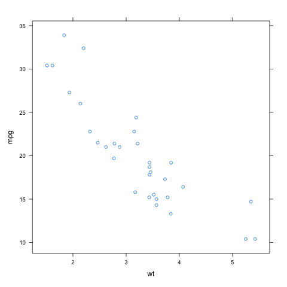
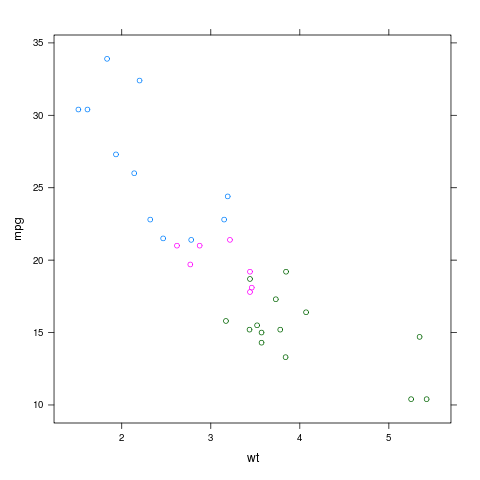
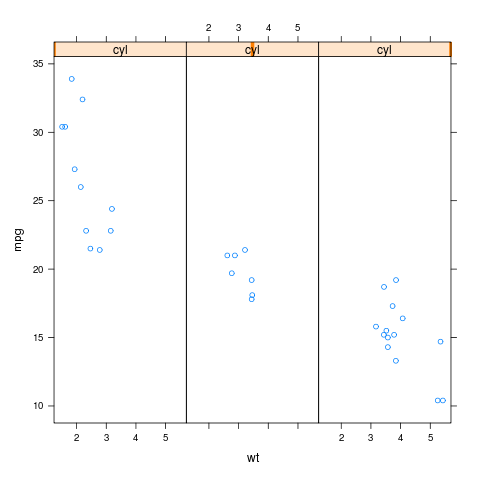
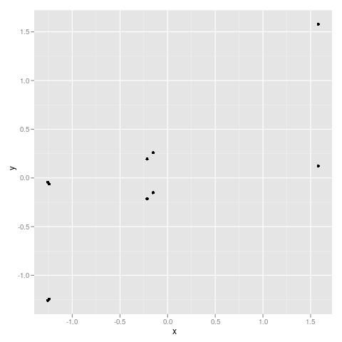
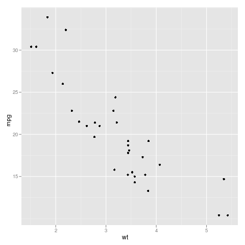
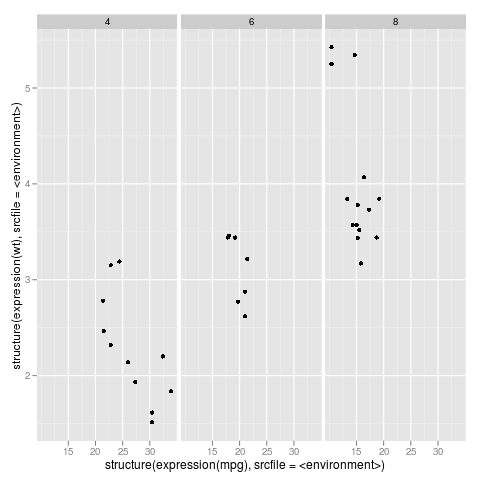

********
Graphics
********

Introduction
============

This section shows how to make R graphics from rpy2, 
using some of the different graphics systems available to R users.

The purpose of this section is to get users going, and be able to figure out
by reading the R documentation how to perform the same plot in rpy2.

Graphical devices
-----------------

With `R`, all graphics are plotted into a so-called graphical device.
Graphical devices can be interactive, like for example `X11`, 
or non-interactive, like `png` or `pdf`. Non-interactive devices
appear to be files.

By default an interactive R session will open an interactive device
when needing one. If a non-interactive graphical device is needed,
one will have to specify it.

.. note::

   Do not forget to close a non-interactive device when done.
   This will flush the writing to the file.

Getting ready
-------------

To run examples in this section we first import
:mod:`rpy2.robjects` and define few helper
functions.

.. literalinclude:: _static/demos/graphics.py
   :start-after: #-- setup-begin
   :end-before: #-- setup-end

Package *lattice*
=================

Introduction
------------

Importing the package `lattice` is done the
same as it is done for other R packages.

.. literalinclude:: _static/demos/graphics.py
   :start-after: #-- setuplattice-begin
   :end-before: #-- setuplattice-end

Scatter plot
------------

We use the dataset *mtcars*, and will use
the lattice function *xyplot* to make scatter plots.

.. literalinclude:: _static/demos/graphics.py
   :start-after: #-- setupxyplot-begin
   :end-before: #-- setupxyplot-end

Lattice is working with formulae (see :ref:`robjects-formula`),
therefore we build one and store values in its environment.
Making a plot is then a matter of calling
the function *xyplot* with the *formula* as
as an argument.

.. literalinclude:: _static/demos/graphics.py
   :start-after: #-- xyplot1-begin
   :end-before: #-- xyplot1-end

The display of group information can be done
simply by using the named parameter groups.
This will indicate the different groups by
color-coding.

.. literalinclude:: _static/demos/graphics.py
   :start-after: #-- xyplot2-begin
   :end-before: #-- xyplot2-end

An alternative to color-coding is to have 
points is different *panels*. In lattice,
this done by specifying it in the formula.

.. literalinclude:: _static/demos/graphics.py
   :start-after: #-- xyplot3-begin
   :end-before: #-- xyplot3-end

Package *ggplot2*
=================

Introduction
------------

The R package *ggplot2* relies a lot unevaluated
symbols in R expression, so we create an helper function :func:`as_symbol`
to assist us.

.. literalinclude:: _static/demos/graphics.py
   :start-after: #-- setupggplot2-begin
   :end-before: #-- setupggplot2-end

Plot
----

Making a simple plot is achieved by calling the R/ggplot2 function *qplot*;
we define a Python-level alias for it as we are going to call it few times.

That function shares a lot of similarity with R's default plot function,
or the xyplot function from lattice.

.. literalinclude:: _static/demos/graphics.py
   :start-after: #-- qplot1-begin
   :end-before: #-- qplot1-end

When using the dataset *mtcars*, as done previously with lattice,
care should be taken to have the names of the variables to plot
as unevaluated expression. Beside that, the call to :func:`qplot`
is straightforward.

.. literalinclude:: _static/demos/graphics.py
   :start-after: #-- qplot2-begin
   :end-before: #-- qplot2-end

Splitting the data into panels, in a similar fashion to what we did
with *lattice*, is now a matter of adding *facets*. Adding specifications
about what or how to plot data with *ggplot2* is performed with the
*+* operator in R. Noting that the *ggplot* objects are of class
:class:`RVector`, we simply use the delegator for R operations :attr:`ro`
(see :ref:`robjects-operationsdelegator` for more about delegated R operations).

.. literalinclude:: _static/demos/graphics.py
   :start-after: #-- ggplot1-begin
   :end-before: #-- ggplot1-end

   

Adding graphical elements
^^^^^^^^^^^^^^^^^^^^^^^^^

.. literalinclude:: _static/demos/graphics.py
   :start-after: #-- qplot3-begin
   :end-before: #-- qplot3-end
   
.. image:: _static/graphics_ggplot2_qplot_3.png
   :scale: 50

.. literalinclude:: _static/demos/graphics.py
   :start-after: #-- qplot3addline-begin
   :end-before: #-- qplot3addline-end

   
.. image:: _static/graphics_ggplot2_qplot_4.png
   :scale: 50

.. literalinclude:: _static/demos/graphics.py
   :start-after: #-- qplot3addsmooth-begin
   :end-before: #-- qplot3addsmooth-end

   
.. image:: _static/graphics_ggplot2_qplot_5.png
   :scale: 50

.. literalinclude:: _static/demos/graphics.py
   :start-after: #-- qplot3addsmoothblue-begin
   :end-before: #-- qplot3addsmoothblue-end

   
.. image:: _static/graphics_ggplot2_qplot_6.png
   :scale: 50

.. literalinclude:: _static/demos/graphics.py
   :start-after: #-- ggplot1addsmooth-begin
   :end-before: #-- ggplot1addsmooth-end

   
.. image:: _static/graphics_ggplot2_qplot_7.png
   :scale: 50

.. literalinclude:: _static/demos/graphics.py
   :start-after: #-- ggplot2-begin
   :end-before: #-- ggplot2-end

   
.. image:: _static/graphics_ggplot2_ggplot_add.png
   :scale: 50

